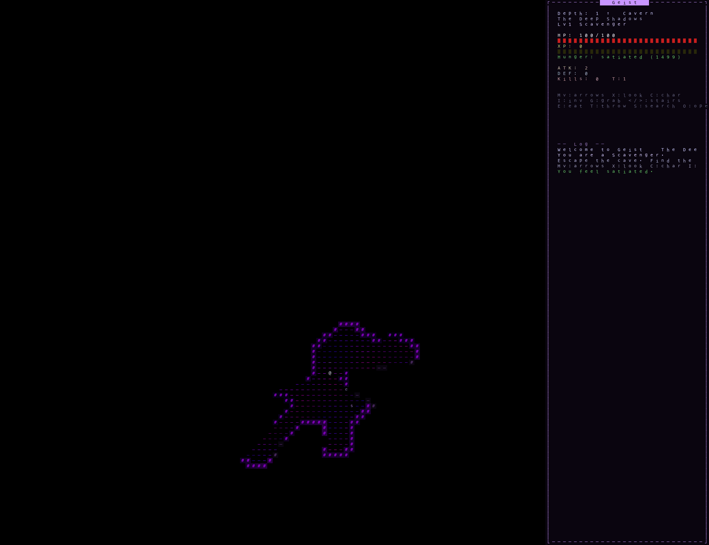
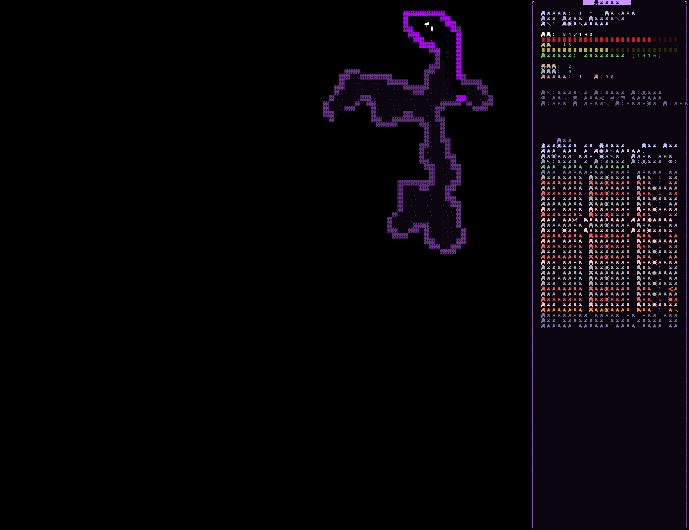

# Geist
A philosophy-inspired roguelike with Dijkstra-Maps, deep item systems, and dozens of interlocking mechanics.



## The Story
You've been tasked by Plato to ascend through his caves to find the ethereal "Thing-in-Itself", defeat its guardian (Immanuel Kant), and bring it back. Seven themed depths stand between you and the truth — each with unique monsters, traps, and challenges. Grab the Thing-in-Itself at the top, then descend back through corrupted versions of every level to escape.

## Features

### World
- 7 themed dungeon depths with animated, shimmering color palettes
- 10 procedural layout generators (cavern, cathedral, BSP, maze, rings, islands, worms, drunkard, arena, classic)
- 6 special room types: vaults, arenas, shrines, libraries, armories, gardens
- Doors at corridor chokepoints — bump to open, or press `o`
- 10 hidden trap types scattered through every level
- Corrupted descent: after grabbing the Truth, every level darkens with tougher enemies and blocked passages

### Creatures
- ~38 unique monster types across 7 depths, each with philosophy-themed names
- 12 enemy prefixes (Frenzied, Spectral, Armored, Stalking, Venomous, Splitting, Invisible...) plus rare Champions
- 11 monster special abilities: ranged attacks, poison touch, stat drain, teleportation, summoning, splitting, ally healing, item theft, self-destruct, invisibility, paralyzing gaze
- 6 AI behaviors powered by Dijkstra maps: standard pursuit, berserker rage, stalker (moves only when unseen), coward (flees at low HP), swarm (groups up before rushing), allied

### Items
- **Weapons** (`/`) and **Armor** (`[`) with power/defense bonuses and elemental affixes (Flaming, Frozen, Venomous, Thundering)
- **14 potion types** (`!`): Healing, Greater Healing, Poison, Speed, Might, Resistance, Invisibility, Blindness, Confusion, Paralysis, Levitation, Regeneration, Experience, True Sight
- **14 scroll types** (`?`): Mapping, Teleportation, Fear, Mending, Imperative, Transcendence, Enchant Weapon, Enchant Armor, Identify, Remove Curse, Summoning, Fire, Protection, Amnesia
- **8 wand types** (`~`): Animation, Negation, Transposition, Petrification, Revelation, Sundering, Communion, Entropy — each with 5 unique interactions (hit living, corpse, wall, item, or empty space)
- **10 ring types** (`=`): Protection, Strength, Regeneration, Fire/Cold/Poison Resistance, True Sight, Stealth, Hunger (cursed), Teleportation (cursed)
- **7 amulet types** (`"`): Life Saving (cheat death once), ESP (see all monsters), Reflection, Vitality (+20 max HP), Wisdom (+50% XP), Strangulation (cursed), Restful Sleep (cursed)
- **5 food types** (`%`): Rations, Bread, Dried Meat, Cave Mushrooms (random effect), Philosophical Texts (+XP)
- Item affixes: 10 prefixes and 8 suffixes that modify stats, add elements, or grant special properties

### Systems
- **Item identification**: Potions, scrolls, rings, and amulets have randomized unknown names each run — "murky potion", "scroll labeled DASEIN", "jade ring". Use them or read a Scroll of Identify to learn what they really are
- **Hunger**: Satiation decreases each turn. Eat food, rations, or monster corpses to survive. Starve and you die. Different traits have different hunger rates
- **Corpse eating**: Monsters drop edible corpses. Some grant permanent intrinsic resistances (eat a Fire Phantasm for fire resistance). Corpses rot after 100 turns
- **10 status effects**: Poison (tick damage), Blind (FOV radius 1), Haste, Slow, Invisible, Regenerating, Burning, Frozen, Levitating (float over traps), Confused
- **Elemental system**: Fire, Cold, Poison, Lightning damage types with matching resistances from rings, corpse intrinsics, or equipment
- **Combat depth**: d20 hit rolls, critical hits on natural 20, misses on natural 1, evasion stat, elemental damage
- **Throwing**: Throw any item — weapons deal damage, potions splash their effects on the target
- **10 trap types**: Bear Trap (immobilize), Pit, Spiked Pit, Teleport, Arrow, Poison Dart, Fire, Alarm (wakes all monsters), Confusion Gas, Sleep Gas. Search with `s` to reveal hidden traps
- **4 equipment slots**: Weapon, Armor, Ring, Amulet — each with passive effects
- **Wand system**: 8 wand types with animated bolt VFX, each behaving differently based on what they hit (40 unique interactions total)
- **6 player traits**: Scholar (+20 HP), Warrior (+2 ATK, fast hunger), Sentinel (+2 DEF), Mystic (+2 wand charges, slow hunger), Scavenger (extra item, very slow hunger), Ascetic (balanced stats, half hunger)
- **15 XP levels** with cycling stat boosts (+HP, +ATK, +DEF)
- **Auto-explore**: Press `a` to automatically explore, stops when danger is detected

## Controls

### Movement & Exploration
| Key | Action |
|-----|--------|
| Arrow keys / Numpad / `hjklyubn` | Move (8-directional) |
| Numpad 5 | Wait a turn (regen 1 HP) |
| `a` | Auto-explore |
| `x` | Look mode (examine tiles) |
| `s` | Search (reveal adjacent traps) |
| `o` | Open adjacent door |
| `< > .` | Use stairs |

### Items & Equipment
| Key | Action |
|-----|--------|
| `g` | Pick up item |
| `i` | Open inventory |
| `e` | Eat (corpse at feet, or food from inventory) |
| `t` | Throw (select from inventory, then aim) |
| `d` (in inventory) | Toggle drop mode |
| `t` (in inventory) | Toggle throw mode |
| `a-z` (in inventory) | Use / equip / drop / throw selected item |

### Other
| Key | Action |
|-----|--------|
| `c` | Character screen |
| Left click | Move / attack / fire |
| Right click | Look at tile |
| Esc | Cancel / quit |

## Running

```bash
uv sync
uv run python main.py
```

Requires Python 3.13+.

## Tips
- **Identify before quaffing**: Unknown potions can blind, poison, or paralyze you. Use Scrolls of Identify or a Wand of Revelation first, or quaff at full HP and near stairs
- **Eat corpses early**: They rot after 100 turns. Fire Phantasm and Cave Crawler corpses grant permanent resistances
- **Manage hunger**: Scavenger and Ascetic traits have much lower hunger rates. Rations give 800 satiation — hoard them
- **Search narrow corridors**: Traps love chokepoints. Press `s` before walking through tight passages
- **Amulet of Life Saving**: The most valuable item in the game. It saves you from death once, then crumbles
- **Wand of Animation**: Turn walls into allies, resurrect corpses to fight for you, or animate items. Your starting wand is powerful — use it wisely
- **Throw potions**: A Potion of Poison thrown at an enemy poisons them. A Potion of Confusion thrown creates a confused enemy

## Screenshot



## Visual Development Log

(Current)


(Second Release)


(First Release)


